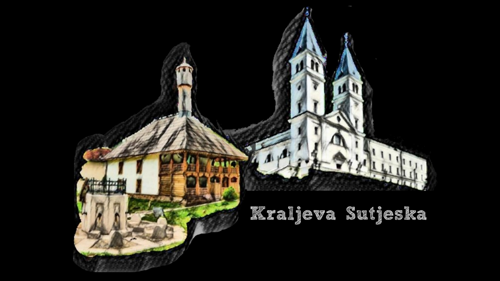

# Kraljeva Sutjeska - AR

## Opis

Kraljeva Sutjeska - AR je Augmented Reality mobilna aplikacija. Omogućava vam da skenirate jednu od sljedećih fotografija i uživate u 3D modelima naših veličanstvenih historijskih građevina. 

## Kako koristiti

Kako bi koristili aplikaciju, potrebno je na svoj mobilni uređaj download-ovati app.apk file koji se nalazi na [ovom linku](https://drive.google.com/drive/folders/1wo4B6grIMJrXdFTLEITTFzU6pkvGgUKf?usp=sharing). Nakon što download-ujete aplikaciju i pokrenete, potrebno je imati Image recognition, odnosno odgovarajuće fotografije koje ćete skenirati. Fotografije se nalaze i na prethodnom linku i u folderu ImageRecognition na ovom repozitoriju. Nakon što skenirate fotografiju i pojavi se model jedne od građevina, uživajte i istražite divan samostan i džamiju.

Video pokretanja, skeniranja i korištenja aplikacije možete naći [ovdje](https://drive.google.com/drive/folders/1-1neTtgjjc5tSak-cdq9ZNLHKmod7xYH?usp=sharing).

## Render vs. Real Image

  
   

  
   

## Tehnologije
* Blender
* Unity

####

